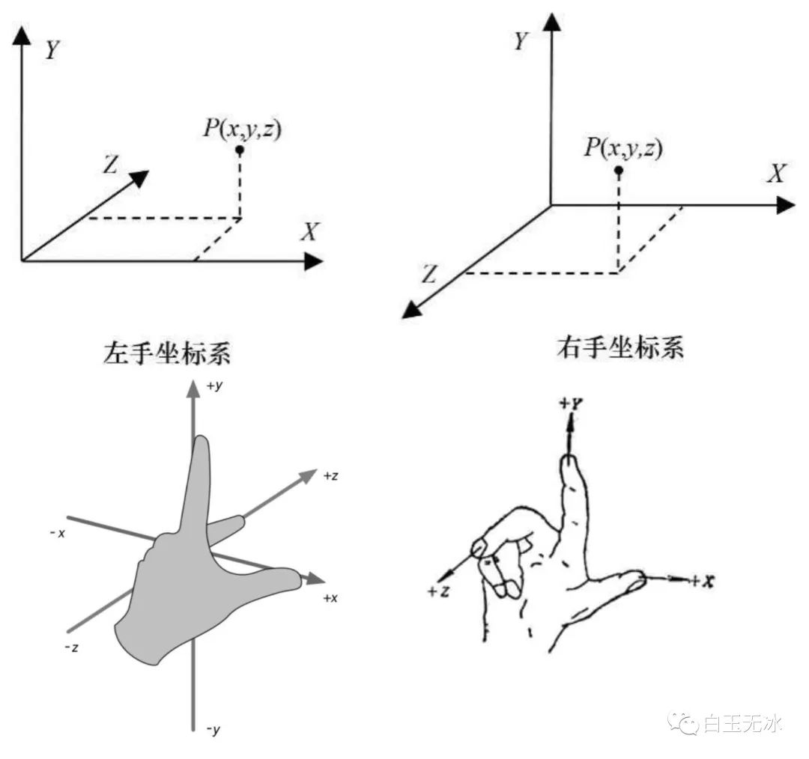
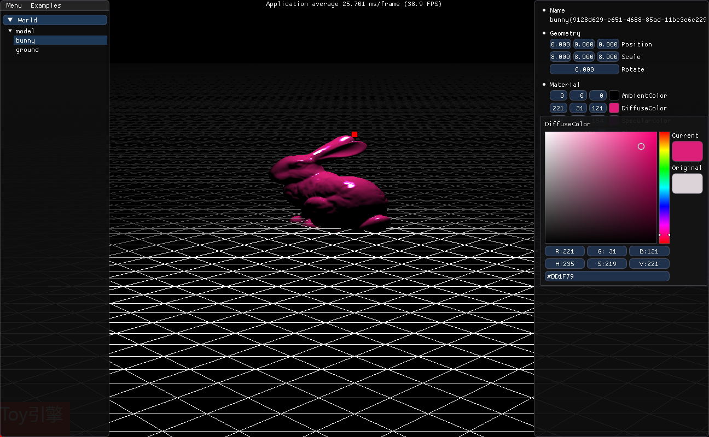

### Qt安装 
#### Mac安装
```
brew install qt
brew install cmake
brew install glfw
brew install glm
```


#### Glad配置

在[glad](https://gen.glad.sh/)下载glad依赖文件


### 参考

> https://github.com/JoeyDeVries/LearnOpenGL
> https://www.opengl.org/archives/resources/code/samples/glut_examples/examples/examples.html
> https://learnopengl.com/code_viewer_gh.php?code=src/1.getting_started/7.4.camera_class/camera_class.cpp
> https://ogldev.org/index.html

obj格式
> https://www.cs.cmu.edu/~mbz/personal/graphics/obj.html

---

### 问题解决记录

#### 1.  error: failed to compile #version 330

```shader
panic: failed to compile #version 330

uniform vec3 viewPos;
uniform vec3 lightPos;
uniform vec3 lightColor;

in vec3 FragPos;
in vec3 Normal;
out vec4 color;
void main() {
    vec3 lightDir = normalize(lightPos - FragPos);

    float diff = max(dot(Normal, lightDir), 0.0);
    vec3 diffuse = diff * lightColor;
    color = vec4(diffuse, 1.0);
}
: 0:17(1): error: syntax error, unexpected $undefined, expecting $end

```

获取shader的变量需要添加"\000"后缀

#### 2.  error: C1189: #error: OpenGL header already included, remove this include, glad already provides it.

原因是#include <glad/glad.h>位置不当。

#include <glad/glad.h>必须放在所有头文件之前，不管在哪里，不管在.h还是.cpp;

---

### 坐标系

OpenGL是右手坐标系


## ScreenShots


